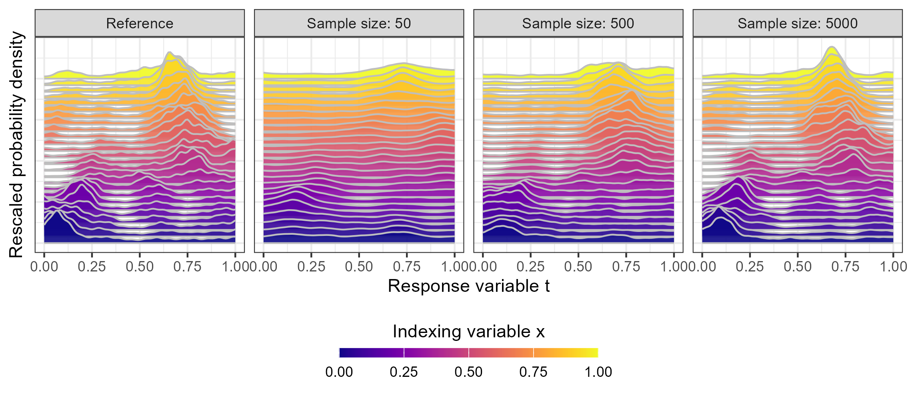
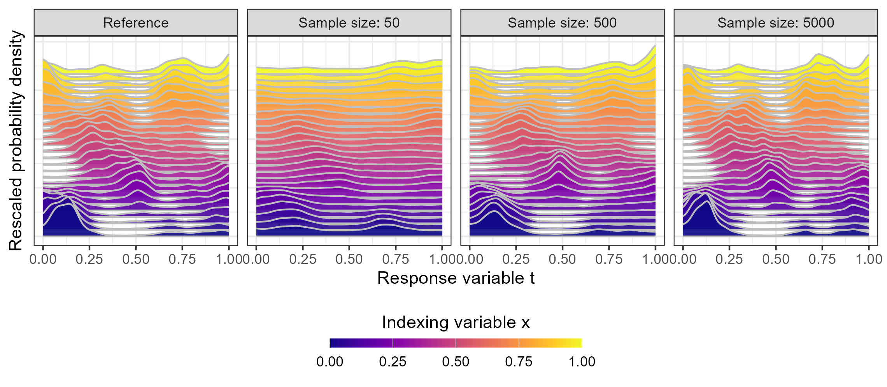
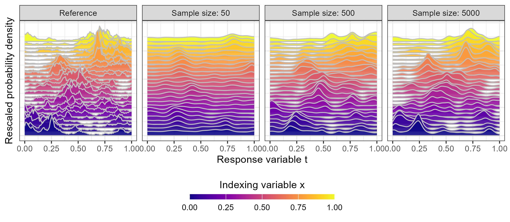

\newcommand{\xX}{\mathbf{x}}
\newcommand{\xI}{\mathcal{T}}
\newcommand{\xR}{\mathbb{R}}
\newcommand{\dimI}{d_\xI}
\newcommand{\dimD}{d_D}
\newcommand{\dxx}{d_{\xX, \xX'}}
\newcommand{\kincrement}{k_{\text{inc}}}
\newcommand{\mincrement}{m_{\text{inc}}}
\newcommand{\xM}{M(\xX, \xX')}
\newcommand{\diam}{D_{\xX, \xX'}(\xI)}
\newcommand{\xY}{\Vert \xX - \xX' \Vert^{\alpha_1 /2}}
\newcommand{\sigFieldM}{\mathcal{B}(\xI)}

\newcommand{\proc}[3]{
\ifstrempty{#3}%
{%
\ifstrempty{#2}%
{%
#1
}{%
#1_{#2}
}%
}{%
(#1_{#2})_{#3}
}%
}

```{r setup, include=FALSE}
knitr::opts_chunk$set(echo = TRUE)
library(tidyverse)
library(ggplot2)
library(viridis)
```


# Introduction

This document is about exploring the posterior consistency of Spatial Logistic Gaussian Processes (SLGPs) in estimating response distributions given predictor values.
While a few fundamental concepts of SLGP modeling are stated here for context, readers interested in a deeper understanding of SLGPs and their mathematical foundations are encouraged to refer to our main paper, @gautier_continuous_2021.


In this context, we are interested in learning the distribution of a random response $T_x$, where $x$ represents the predictors (or indexing variable). The challenge arises when the dependence between $T_x$ and $x$ extends beyond just the mean and variance, encompassing more complex features such as the shape of the distribution, its uni-modal versus multi-modal nature, and other distributional characteristics. 

To address this, we propose a flexible approach to modeling spatially-dependent probability distributions using SLGPs. This approach leverages a well-behaved latent Gaussian Process (GP), which undergoes a non-linear transformation, making it suitable for complex distributional modeling. For the sake of simplicity, we will consider that both the indexing variable $x$ and the response $t$ are in $[0, 1]$

# Some basics in SLGP modelling

The SLGP model, related to \citet{tokdar_bayesian_2010} and being at the center of the present contribution following up on [TODO: citation]\citep{gautier_goal-oriented_2021, gautier_continuous_2021, gautier_modelling_2023}, is itself a spatial generalization of the Logistic Gaussian Process models, which were established and studied in [TODO: citation]\citep{lenk_logistic_1988, lenk_towards_1991, leonard_density_1978}.

The SLGP for spatially dependent density estimation builds upon a well-behaved GP $(Z_{\xX, t})_{(\xX, t) \in [0, 1]^2}$ and studies the stochastic process obtained from applying the spatial logistic density transformation to $Z$ as follows:

\[
\label{eq:informalSLGP}
\Psi[Z](\xX, t)= \dfrac{e^{Z_{\xX, t}}}{\int_{[0, 1]} e^{Z_{\xX, u}} \,d\lambda(u) } \text{ for all } (\xX, t) \in [0, 1]^2
\]

At any fixed $\xX$, $\Psi[Z](\xX, \cdot)$ hence returns a random function that is, by construction, positive and integrates to one, therefore, a SLGP can be (informally) seen as a field of random pdfs. What the mathematical objects involved precisely are (in terms of random measures or densities, and fields thereof) calls for some careful analysis, and we refer the reader to [TODO: citation]\citep{gautier_continuous_2021} for more details on the topic. 

For the sake of simplicity, in this document we focus on SLGPs obtained by transforming finite-rank GPs, and as such consider function $\left( f_{i} \right)_{1\leq i \leq p}$ on $[0, 1]^2$. This yields finite-rank GPs that we can write as follows:
\[
\label{eq:GPextension}
Z(\xX, t) =  \sum_{j=1}^p f_{j}(\xX, t) \varepsilon_j = \boldsymbol \varepsilon^\top F_{}(\xX, t)  , \ \forall \xX, t \in [0, 1], \ \
\]
where $F_{}(\xX, t):=\left( f_{j}(\xX, t) \right)_{1\leq j \leq p}$ is the vector of basis functions evaluated at $(\xX, t)$ and $\boldsymbol \varepsilon$ is a random vector of $p$ i.i.d. $\mathcal{N}(0, \sigma^2)$ random variables.


In this work, we focus on implementation and practicalities. For this purpose, we consider that our observations are obtained by independent sampling of a reference probability density field $p_0$. By that, we mean that our dataset consist in  $n$ couples of locations and observations $ \{(\xX_i, t_i)\}_{1 \leq i \leq n}$, where the $\xX_i$ are in $[0, 1]$. Moreover, we assume the $t_i$'s are obtained by independent sampling of random variables $T_i$ with respective densities $p_0(\xX_i, \cdot)$.

The posterior distribution of $\varepsilon $, given data $\{(\xX_i, t_i)\}_{i=1}^n$ is:
\[
\label{eq:GPposterior}
\pi[\boldsymbol \epsilon \vert  \mathbf{T} = \mathbf{t} ] \propto   \phi_p\left( \boldsymbol\epsilon \right)  \prod\limits_{i=1}^n \dfrac{e^{\sum_{j=1}^p \epsilon_j f_{j}(\xX_i, t_i)}}{ \int_t e^{\sum_{j=1}^p \epsilon_j f_{j}(\xX_i, u)}  \,du}
\]
where $\phi_p$ is the pdf of the $p$-variate standard normal distribution. This formulation allows us to perform posterior inference, here maximum a posteriori (MAP) estimation.

It is important to note that the choice of basis functions is flexible, provided they form a sufficiently expressive and numerically stable family. In this work, we propose using Fourier-type bases, consisting of multivariate sines and cosines. These bases are not only expressive and well-behaved numerically, but they also allow for an intuitive understanding of spatial regularity through their connection to spectral approximations of GPs, commonly referred to as the Random Fourier Feature (RFF) approach.


# Synthetic test cases

To assess the performance of SLGP-based models, we define four reference probability density fields. These fields are generated as realizations of finite-rank SLGPs. The hyperparameters of these SLGPs are known and consistent across all four references. However, the spatial regularity of these fields varies and enables us to explore the impact of spatial regularity on the performance of SLGP-based models and assess their ability to capture the underlying structure of the data.
```{r include=FALSE}
library(SLGP)
```


```{r modelsnotev, eval=FALSE, include=FALSE}
SLGP1 <- slgp(t~x,
              data=data.frame(t=c(0, 1), x=c(0, 1)),
              method ="none",
              basisFunctionsUsed="RFF",
              interpolateBasisFun="WNN",
              hyperparams = list(lengthscale=c(0.15, 0.15), sigma2=0.5),
              sigmaEstimationMethod = "none",
              seed=1,
              opts_BasisFun = list(MatParam=1/2,
                                   nFreq=500,
                                   kernel="Exp"))
SLGP2 <- slgp(t~x,
              data=data.frame(t=c(0, 1), x=c(0, 1)),
              method ="none",
              basisFunctionsUsed="RFF",
              interpolateBasisFun="WNN",
              hyperparams = list(lengthscale=c(0.15, 0.15), sigma2=0.5),
              sigmaEstimationMethod = "none",
              seed=1,
              opts_BasisFun = list(MatParam=3/2,
                                   nFreq=500,
                                   kernel="Exp"))
SLGP3 <- slgp(t~x,
              data=data.frame(t=c(0, 1), x=c(0, 1)),
              method ="none",
              basisFunctionsUsed="RFF",
              interpolateBasisFun="WNN",
              hyperparams = list(lengthscale=c(0.15, 0.15), sigma2=0.5),
              sigmaEstimationMethod = "none",
              seed=1,
              opts_BasisFun = list(MatParam=5/2,
                                   nFreq=500,
                                   kernel="Exp"))
SLGP4 <- slgp(t~x,
              data=data.frame(t=c(0, 1), x=c(0, 1)),
              method ="none",
              basisFunctionsUsed="RFF",
              interpolateBasisFun="WNN",
              hyperparams = list(lengthscale=c(0.15, 0.15), sigma2=0.5),
              sigmaEstimationMethod = "none",
              seed=1,
              opts_BasisFun = list(MatParam=Inf,
                                   nFreq=500,
                                   kernel="Exp"))
```

```{r modelssave, eval=FALSE, include=FALSE}
save(SLGP1, SLGP2, SLGP3, SLGP4, file="SLGPsRef.Rdata")
```

```{r modelsload, include=FALSE}
load(file="SLGPsRef.Rdata")
```

We display the corresponding probability density functions (PDFs) for a few instances of the underlying indexing variable $x$. 

```{r reffigure, fig.cap = "Probability density fields (displayed for a few indices x) with different spatial regularity", fig.fullwidth=TRUE, fig.height=5, fig.width=10, fig.align='center' ,fig.pos="H", warning=FALSE, message=FALSE, echo=FALSE}
set.seed(123)
epsilon <- rnorm(SLGP1@p, sd=sqrt(SLGP1@hyperparams$sigma2))
SLGP1@coefficients <-
  SLGP2@coefficients <-
  SLGP3@coefficients <-
  SLGP4@coefficients <- as.matrix(t(epsilon))

dfGrid2 <- data.frame(expand.grid(seq(0, 1,, 1001), seq(0, 1,, 101)))
colnames(dfGrid2) <- c("t", "x")

pred1 <- predictSLGP_newNode(SLGPmodel = SLGP1,
                             newNodes = dfGrid2)
pred1$kernel <- "Lowest"

pred2 <- predictSLGP_newNode(SLGPmodel = SLGP2,
                             newNodes = dfGrid2)
pred2$kernel <- "Low"

pred3 <- predictSLGP_newNode(SLGPmodel = SLGP3,
                             newNodes = dfGrid2)
pred3$kernel <- "High"

pred4 <- predictSLGP_newNode(SLGPmodel = SLGP4,
                             newNodes = dfGrid2)
pred4$kernel <- "Highest"

scale_factor <- 0.05
dfplot <- rbind(pred1, pred2, pred3, pred4)
dfplot$kernel <- factor(paste0("Spatial regularity:\n", dfplot$kernel),
                        levels=paste0("Spatial regularity:\n", 
                                      c("Lowest", "Low", "High", "Highest")))

dfplot %>%
  dplyr::filter(x %in% seq(0, 1,, 26))%>%
  ggplot(aes(x=t, ymax=scale_factor*pdf_1+x, ymin=x, group=-x, fill=x))+
  geom_ribbon(col="grey", alpha=0.9)+  # Add grey borders around each tile
  scale_fill_viridis(option = "plasma",
                     guide = guide_colorbar(nrow = 1,
                                            title = "Indexing variable x",
                                            barheight = unit(2, units = "mm"),
                                            barwidth = unit(55, units = "mm"),
                                            title.position = 'top',
                                            label.position = "bottom",
                                            title.hjust = 0.5))+
  facet_grid(.~kernel)+
  theme_bw()+
  theme(legend.position = "bottom", axis.text.y = element_blank(),
        axis.ticks.y = element_blank(), axis.line.y = element_blank())+
  ylab("Rescaled probability density")+
  xlab("Response variable t")

ggsave(file=paste0("./figures/ref_fields2.png"), width = 8, height=3.5, scale=0.95)
ggsave(file=paste0("./figures/ref_fields2.pdf"), width = 8, height=3.5, scale=0.95)

```

We draw samples from each of these four reference probability density fields at various values of the indexing variable $x$. These samples will be used to perform the inference, enabling us to assess how well the SLGP-based models can recover the underlying distributions. For each field, we generate 25 samples, with each sample consisting of up to 250000 data points.

```{r pardefine, include=FALSE}
nmax <- 1e7
nRep <- 100
```

```{r samplegeneration, eval=FALSE}
nmax <- 1e7
nRep <- 100
i<- 1
for(i in seq(10000*5)){
  cat(i, ".1\n")
  set.seed(1e6+i)
  x_candidates <- runif(nmax*nRep/10000/5)
  set.seed(i)
  sampTemp <- sampleSLGP(SLGPmodel=SLGP1, 
                         interpolateBasisFun="WNN",
                         newX=data.frame(x=x_candidates), 
                         n=1, 
                         nIntegral=101,
                         nDiscret=101)
  samp<- data.frame(x=sampTemp$x,
                    t1 = sampTemp$t)
  set.seed(i)
  cat(i, ".2\n")
  sampTemp <- sampleSLGP(SLGPmodel=SLGP2, 
                         interpolateBasisFun="WNN",
                         newX=data.frame(x=x_candidates), 
                         n=1,
                         nIntegral=101,
                         nDiscret=101)
  samp$t2<- sampTemp$t
  set.seed(i)
  cat(i, ".3\n")
  
  sampTemp <- sampleSLGP(SLGPmodel=SLGP3, 
                         interpolateBasisFun="WNN",
                         newX=data.frame(x=x_candidates), 
                         n=1,
                         nIntegral=101,
                         nDiscret=101)
  samp$t3<- sampTemp$t
  set.seed(i)
  cat(i, ".4\n")
  
  sampTemp <- sampleSLGP(SLGPmodel=SLGP4, 
                         interpolateBasisFun="WNN",
                         newX=data.frame(x=x_candidates), 
                         n=1,
                         nIntegral=101,
                         nDiscret=101)
  samp$t4<- sampTemp$t
  save(samp, file=paste0("./samp/SLGPsSamp", i, ".Rdata"))
}
rm(sampTemp)
gc()

for(i in seq(nRep)){  
  sampAll <- data.frame()
  for(j in seq(nmax/(nmax*nRep/10000/5))){
    cat(i, ".", j, "\n")
    load(file=paste0("samp/SLGPsSamp", i, ".Rdata"))
    sampAll <- rbind(sampAll, samp)
  }
  set.seed(i)
  shuffle <- sample(seq(nrow(sampAll)))
  samp <- sampAll[shuffle, ]
  save(samp, file=paste0("samples/SLGPsSamp", i, ".Rdata"))
}

```

```{r eval=FALSE, include=FALSE}
load(file="SLGPsSamps.Rdata")
colnames(samp) <- c("x", "Lowest smoothness", "Low smoothness", "High smoothness", "Highest smoothness")
samp[1:1000000, ] %>%
  pivot_longer(-x) %>%
  ggplot(aes(x=x, y=value)) +
  stat_density_2d(aes(fill = after_stat(density)), geom = "raster", contour = FALSE)+
  facet_grid(.~name)+
  scale_fill_continuous(type = "viridis") +
  theme_bw()

dfplot %>%
  ggplot(aes(x=x, y=t, fill=pdf_1)) +
  geom_raster()+
  facet_grid(.~kernel)+
  scale_fill_continuous(type = "viridis") +
  theme_bw()
```


```{r sampleload, include=FALSE}
listN <- c(   5, 10, 
              25, 50, 100, 
              250, 500, 1000, 
              2500, 5000, 10000, 
              25000, 50000, 100000, 
              250000, 500000, 1000000, 
              2500000, 5000000, 10000000)
```


With the synthetic data now fully prepared, we can proceed to the estimation phase to evaluate the SLGP-based models.

# Sample-based inference with SLGP modelling

This phase involves conducting inference experiments under various conditions to comprehensively assess the models' ability to recover the underlying distributions.

To achieve this, we vary the following over different experiments:

* Reference Fields: we consider four distinct reference probability density fields.

* Levels of Smoothness: we consider different SLGP modeling, corresponding to the different kernel functions used in generating the reference fields.
* Exponential Kernel: This kernel parametrizes GPs whose realizations are continuous but not differentiable. It produces fields with rough spatial structures.
* Matérn 3/2 Kernel: Known for parametrizing GPs whose realizations are once continuously differentiable, this kernel generates fields with moderate smoothness.
* Matérn 5/2 Kernel: This kernel parametrizes GPs that are twice continuously differentiable, resulting in smoother fields compared to the Matérn 3/2 kernel.
* Gaussian Kernel: Also known as the Radial Basis Function (RBF) kernel, this kernel parametrizes GPs whose realizations are infinitely differentiable, producing fields with very smooth spatial structures.

* Number of Basis Function Frequencies: We work with various numbers of basis functions in the parametrization of the SLGP, determined through the Random Fourier Features (RFF) method. We compare having 25, 50, 100, 250 or 500 basis frequencies, and twice as many basis functions (one sine, one cosine for each frequency).
* Sample Sizes: we work with a range of sample sizes, varying from 5 to 10000000 data points.

To ensure the robustness of our results and mitigate the impact of random seed variability, we perform 100 repetitions for each experimental setting. This comprehensive experimental design leads to a total of:
\[
\underbrace{100}_{\text{Repetitions}} \times 
\underbrace{4}_{\text{Reference Models}} \times 
\underbrace{4}_{\text{Levels of Smoothness}} \times 
\underbrace{5}_{\text{Number of Basis Functions}} \times 
\underbrace{20}_{\text{Sample Sizes}} = 160,000 \text{ experiments}
\]


By conducting these 160,000 experiments, we aim to thoroughly evaluate the posterior consistency and overall performance of SLGP-based models across diverse scenarios, varying in data sparsity, model smoothness, and basis function complexity.

For reproducibility, we provide the code used to perform the analyses. However, due to the independence of each experiment, we executed them in parallel on, UBELIX the high-performance computing cluster of the University of Bern.

```{r estimationnoteval, eval=FALSE}
listN <- c(5, 10, 
           25, 50, 100, 
           250, 500, 1000, 
           2500, 5000, 10000, 
           25000, 50000, 100000, 
           250000, 500000, 1000000, 
           2500000, 5000000, 10000000)
rep <- 1
ref <- 1
modid <- 1
nFreq <- 25
n <- 25
for(rep in seq(nRep)){
  load(file=paste0("samples/SLGPsSamp", rep, ".Rdata"))
  for(nFreq in c(25, 50, 100, 250, 500)){
    for(ref in seq(4)){
      for(modid in seq(4)){
        for(n in listN){
          title_file <- paste0("./res/SLGP_ref", ref, 
                               "_mod", modid, "_freq", nFreq, 
                               "_n", n, "_rep", rep, ".RData")
          if(!file.exists(title_file)){
            cat(title_file, "\n")
            ind <- c(1:n)
            if(ref==1){
              #exp
              current_samp <- data.frame(t=samp$t1[ind], x=samp$x[ind])
              refval <- pred1$pdf_1
              BasisFunParam <- SLGP1@BasisFunParam
            }
            if(ref==2){
              #Mat32
              current_samp <- data.frame(t=samp$t2[ind], x=samp$x[ind]) 
              refval <- pred2$pdf_1
              BasisFunParam <- SLGP2@BasisFunParam
            }
            if(ref==3){
              #Mat52            
              current_samp <- data.frame(t=samp$t3[ind], x=samp$x[ind]) 
              refval <- pred3$pdf_1
              BasisFunParam <- SLGP3@BasisFunParam
              
            }
            if(ref==4){
              #Gau
              current_samp <- data.frame(t=samp$t4[ind], x=samp$x[ind]) 
              refval <- pred4$pdf_1
              BasisFunParam <- SLGP4@BasisFunParam
            }
            BasisFunParam$freq <- BasisFunParam$freq[c(1:nFreq, 500+(1:nFreq)), ]
            BasisFunParam$coef <- rep(1/sqrt(nFreq), 2*nFreq)
            BasisFunParam$offset <- BasisFunParam$offset[c(1:nFreq, 500+(1:nFreq))]
            if(modid==4){
              mod <- slgp(t~x,
                          data=current_samp,
                          method ="MAP",
                          basisFunctionsUsed="RFF",
                          interpolateBasisFun="WNN",
                          hyperparams = list(lengthscale=c(0.1, 0.1), sigma2=0.5),
                          predictorsUpper= c(1),
                          predictorsLower= c(0),
                          responseRange= c(0, 1),
                          sigmaEstimationMethod = "none",
                          seed=1,
                          BasisFunParam=BasisFunParam,
                          opts_BasisFun = list(nFreq=nFreq,
                                               MatParam=Inf))
            }else{
              mod <- slgp(t~x,
                          data=current_samp,
                          method ="MAP",
                          basisFunctionsUsed="RFF",
                          interpolateBasisFun="WNN",
                          hyperparams = list(lengthscale=c(0.1, 0.1), sigma2=0.5),
                          predictorsUpper= c(1),
                          predictorsLower= c(0),
                          responseRange= c(0, 1),
                          sigmaEstimationMethod = "none",
                          seed=1,
                          BasisFunParam=BasisFunParam,
                          opts_BasisFun = list(nFreq=nFreq,
                                               MatParam=1/2+modid-1))
            }
            predMod <- predictSLGP_newNode(SLGPmodel = mod, newNodes = dfGrid2)
            predMod$ref <- refval
            dH <- (predMod %>%
                     group_by(x) %>%
                     summarise(value=mean((sqrt(pdf_1) - sqrt(ref))^2)/2) %>%
                     ungroup() %>%
                     summarise(value=sqrt(mean(value))))$value
            save(mod, dH, file=title_file)
          }
        }
      }
    }
  }
}
```
This code is to compile previously obtained results

```{r estimationcompile, eval=FALSE}
dfres <- data.frame()
listN <- c(5, 10, 
           25, 50, 100, 
           250, 500, 1000, 
           2500, 5000, 10000, 
           25000, 50000, 100000, 
           250000, 500000, 1000000, 
           2500000, 5000000, 10000000)
for(rep in seq(nRep)){
  for(nFreq in c(25, 50, 100, 250, 500)){
    for(ref in seq(4)){
      for(modid in seq(4)){
        for(n in listN){
          title_file <- paste0("./res/SLGP_ref", ref, 
                               "_mod", modid, "_freq", nFreq, 
                               "_n", n, "_rep", rep, ".RData")
          if(file.exists(title_file)){
            load(file=title_file)
            tempdf <- data.frame(seed=rep,
                                 nFreq=nFreq,
                                 ref=paste0("Spatial regularity:\n", 
                                            c("Lowest", "Low", "High", "Highest"))[ref],
                                 mod=paste0("Model: \n", 
                                            c("Exponential", "Matérn 3/2", 
                                              "Matérn 5/2", "Gaussian"))[modid],
                                 n=n,
                                 dH=dH)
            dfres <- rbind(dfres, tempdf)
          }
        }
      }
    }
  }
}
dfres$ref <- factor(dfres$ref,
                    levels=paste0("Spatial regularity:\n", 
                                  c("Lowest", "Low", "High", "Highest")))
dfres$mod <- factor(dfres$mod,
                    levels=paste0("SLGP model: \n", 
                                  c("Exponential", "Matérn 3/2", 
                                    "Matérn 5/2", "Gaussian")))
save(dfres, file="compiledRes.RData")
```

We assess the quality of our SLGP-based model estimations using an Integrated Hellinger distance to measure dissimilarity between two probability density valued fields $f(\xX, \cdot)$ and $f'(\xX, \cdot)$:

\[
d_{IH}^2(f(x, \cdot) , f'(x, \cdot) ) = \frac{1}{2}\int_D \int_T \left( \sqrt{f(\mathbf{v}, u)} - \sqrt{f'(\mathbf{v}, u))}  \right)^2 \,du \,d\mathbf{v}
\]

In the following Figure, we display the distribution of $d_{IH}$ between true and estimated fields in our experimental design.

```{r finalplot, fig.fullwidth=TRUE, fig.height=8, fig.width=10, fig.align='center' ,fig.pos="H"}
load(file="compiledRes.RData")

levels(dfres$ref) <- paste0("Spatial regularity of the ref.:\n", 
                            c("Lowest", "Low", "High", "Highest"))
levels(dfres$mod) <- paste0("SLGP model with a: \n", 
                            c("Exponential", "Matérn 3/2", 
                              "Matérn 5/2", "Gaussian"), " kernel")
dfres %>%
  filter(!is.na(dH))%>%
  group_by(nFreq, mod, ref, n)%>%
  summarise(q10=quantile(dH, probs=0.10),
            q25=quantile(dH, probs=0.25),
            q50=quantile(dH, probs=0.50),
            q75=quantile(dH, probs=0.75),
            q90=quantile(dH, probs=0.90),
            .groups="keep")%>%
  ggplot()+
  geom_line(mapping=aes(x=n, y=q50, col=as.factor(2*nFreq)))+
  geom_ribbon(mapping=aes(x=n, ymin=q10, ymax=q90, col=as.factor(2*nFreq), fill=as.factor(2*nFreq)),
              alpha=0.1, lty=2)+
  geom_hline(yintercept = 0, col="grey")+
  facet_grid(mod~ref)+
  scale_x_log10()+
  theme_bw()+
  theme(axis.text.x = element_text(angle = 45, hjust = 1, vjust = 1),
        legend.position = "bottom",
        legend.direction = "horizontal"
  ) +
  labs(
    y = "Integrated Squared Hellinger distance",
    x = "Sample size",
    col = "Number of basis functions",
    fill = "Number of basis functions"
  )

ggsave("consistency-distance.png", width = 10, height=10)
```
```{r include=FALSE, eval=FALSE}
dfres %>%
  filter(!is.na(dH))%>%
  filter(as.numeric(mod) == as.numeric(ref))%>%
  group_by(nFreq, mod, ref, n)%>%
  summarise(q10=quantile(dH, probs=0.10),
            q25=quantile(dH, probs=0.25),
            q50=quantile(dH, probs=0.50),
            q75=quantile(dH, probs=0.75),
            q90=quantile(dH, probs=0.90),
            .groups="keep")%>%
  ggplot()+
  geom_line(mapping=aes(x=n, y=q50, col=as.factor(2*nFreq)))+
  geom_ribbon(mapping=aes(x=n, ymin=q10, ymax=q90, col=as.factor(2*nFreq), fill=as.factor(2*nFreq)),
              alpha=0.1, lty=2)+
  geom_hline(yintercept = 0, col="grey")+
  facet_grid(.~ref)+
  scale_x_log10()+
  theme_bw()+
  theme(axis.text.x = element_text(angle = 45, hjust = 1, vjust = 1),
        legend.position = "bottom",
        legend.direction = "horizontal"
  ) +
  labs(
    y = "Integrated Squared Hellinger distance",
    x = "Sample size",
    col = "Number of basis functions",
    fill = "Number of basis functions"
  )

ggsave("./figures/consistency-distance2.pdf", width = 7, height=3.5)
```


We observe that the quality of the SLGP model’s fit varies across different parameterizations and levels of spatial regularity. In general, on this reduced benchmark, specifying a SLGP that is smoother than the reference field yields better estimation performance than the opposite. Additionally, as expected, increasing the number of basis functions enhances the model’s flexibility, enabling it to better capture fine-scale features.

To further investigate why misfit values plateau and do not converge to zero, we conducted additional experiments. We found that this behavior arises because the data was approximately sampled, meaning the model is effectively recovering this approximation rather than the original "reference" fields.

In the following figures, we display the MAP estimate of the density fields for different sample sizes within a well-specified SLGP setting. These visuals illustrate how the model's performance improves as sample size increases, particularly in settings with smoother spatial regularity.

```{r eval=FALSE, include=FALSE}
rep <- 2
ref <- 1
nFreq <- 500
n <- 50

load(file=paste0("samples/SLGPsSamp", rep, ".Rdata"))

for(ref in seq(4)){
  dfsamp <- data.frame()
  if(ref==1){
    current_samp <- data.frame(t=samp$t1, x=samp$x)
    refval <- as.numeric(pred1$pdf_1)
  }
  if(ref==2){
    current_samp <- data.frame(t=samp$t2, x=samp$x) 
    refval <- as.numeric(pred2$pdf_1)
  }
  if(ref==3){
    current_samp <- data.frame(t=samp$t3, x=samp$x) 
    refval <- as.numeric(pred3$pdf_1)
    
  }
  if(ref==4){
    current_samp <- data.frame(t=samp$t4, x=samp$x) 
    refval <- as.numeric(pred4$pdf_1)
  }
  for(modid in seq(4)){
    dfplot <- dfGrid2
    dfplot$name <- "Reference"
    dfplot$pdf_1 <- refval
    if(modid==1){
      BasisFunParam <- SLGP1@BasisFunParam
    }
    if(modid==2){
      BasisFunParam <- SLGP2@BasisFunParam
    }
    if(modid==3){
      BasisFunParam <- SLGP3@BasisFunParam
      
    }
    if(modid==4){
      BasisFunParam <- SLGP4@BasisFunParam
    }
    for(n in c(50, 500, 5000)){
      title_file <- paste0("./res/SLGP_ref", ref, 
                           "_mod", modid, "_freq", nFreq, 
                           "_n", n, "_rep", rep, ".RData")
      cat(title_file, "\n")
      current_samp2 <- current_samp[1:n, ]
      if(file.exists(title_file)){
        load(file=title_file)
      }else{
        BasisFunParam$freq <- BasisFunParam$freq[c(1:nFreq, 500+(1:nFreq)), ]
        BasisFunParam$coef <- rep(1/sqrt(nFreq), 2*nFreq)
        BasisFunParam$offset <- BasisFunParam$offset[c(1:nFreq, 500+(1:nFreq))]
        if(modid==4){
          mod <- slgp(t~x,
                      data=current_samp2,
                      method ="MAP",
                      basisFunctionsUsed="RFF",
                      interpolateBasisFun="WNN",
                      hyperparams = list(lengthscale=c(0.1, 0.1), sigma2=0.5),
                      predictorsUpper= c(1),
                      predictorsLower= c(0),
                      responseRange= c(0, 1),
                      sigmaEstimationMethod = "none",
                      seed=1,
                      BasisFunParam=BasisFunParam,
                      opts_BasisFun = list(nFreq=nFreq,
                                           MatParam=Inf))
          
        }else{
          mod <- slgp(t~x,
                      data=current_samp2,
                      method ="MAP",
                      basisFunctionsUsed="RFF",
                      interpolateBasisFun="WNN",
                      hyperparams = list(lengthscale=c(0.1, 0.1), sigma2=0.5),
                      predictorsUpper= c(1),
                      predictorsLower= c(0),
                      responseRange= c(0, 1),
                      sigmaEstimationMethod = "none",
                      seed=1,
                      BasisFunParam=BasisFunParam,
                      opts_BasisFun = list(nFreq=nFreq,
                                           MatParam=1/2+modid-1))
        }
        predMod <- predictSLGP_newNode(SLGPmodel = mod, newNodes = dfGrid2)
        predMod$ref <- refval
        predMod$name <- paste0("Sample size: ", n)
        save(predMod, mod, dH, file=title_file)
      }
      dfplot <- rbind(dfplot, predMod[, colnames(dfplot)])
      current_samp2$name <- paste0("Sample size: ", n,"\n")
      dfsamp <- rbind(dfsamp, current_samp2)
    }
    dfplot$pdf_2 <- dfplot$pdf_1-refval
    if(modid==ref){
      title <- "Learning with a well-specified SLGP: MAP estimate of the density field for varying sample sizes"
      subtitle = paste0("Spatial regularity of the reference field and of the SLGP: ", 
                        c("Lowest", "Low", "High", "Highest"))[ref]
    }else{
      title <- "Learning with an ill-specified SLGP: MAP estimate of the density field for varying sample sizes"
      subtitle = paste0("Spatial regularity of the reference field: ", 
                        c("Lowest", "Low", "High", "Highest")[ref],
                        "; of the SLGP:", c("Lowest", "Low", "High", "Highest")[modid])
      
    }
    plot <- dfplot %>%   
      dplyr::filter(x %in% seq(0, 1,, 26))%>%
      # ggplot(aes(x=t, y=x, fill=pdf_1))+
      # geom_raster()+
      ggplot(aes(x=t, ymax=scale_factor*pdf_1+x, ymin=x, group=-x, fill=x))+
      geom_ribbon(col="grey", alpha=0.9)+  # Add grey borders around each tile
      scale_fill_viridis(option = "plasma",
                         guide = guide_colorbar(nrow = 1,
                                                title = "Indexing variable x",
                                                barheight = unit(2, units = "mm"),
                                                barwidth = unit(55, units = "mm"),
                                                title.position = 'top',
                                                label.position = "bottom",
                                                title.hjust = 0.5))+
      facet_grid(.~name)+
      theme_bw()+
      theme(legend.position = "bottom", axis.text.y = element_blank(),
            axis.ticks.y = element_blank(), axis.line.y = element_blank())+
      ylab("Rescaled probability density")+
      xlab("Response variable t")
      # labs(title=title,
      #      subtitle = subtitle)
    ggsave(plot, file=paste0("./figures/ref", ref, 
                             "mod", modid, "nFreq", nFreq, ".png"), 
           width = 8, height=3.5, scale=0.95)
    ggsave(plot, file=paste0("./figures/ref", ref, 
                             "mod", modid, "nFreq", nFreq, ".pdf"), 
           width = 8, height=3.5, scale=0.95)
    
  }
}
```

# Well-specified cases

{ width=100% }

{ width=100% }

{ width=100% }


{ width=100% }

# Ill-specified case


{ width=100% }


{ width=100% }

<hr>
# References
